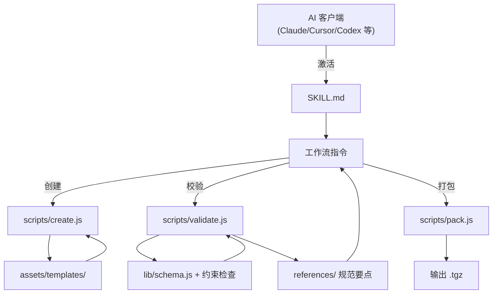

# 架构设计

## 系统概述

Agent Plugin Kit 是一个以 Agent Skill 形态交付的自包含工具包。整体架构分为四层：**Skill 指导层**（SKILL.md 驱动 AI 工作流）、**脚本引擎层**（Node.js 可执行脚本实现确定性操作）、**规范数据层**（Schema 定义与规范要点参考）、**模板资源层**（脚手架生成的骨架模板）。

核心设计理念是「指令负责认知，脚本负责确定性」：AI 通过 SKILL.md 理解规范与流程，凡是可以程序化验证或生成的内容全部下沉到脚本引擎执行，从而消除 LLM 手工操作的不确定性。

## 技术栈

| 组件 | 技术 | 说明 |
|------|------|------|
| Skill 主体 | Agent Skills 规范 | 符合 agentskills.io 规范，可安装到主流 AI 客户端 |
| 脚本引擎 | Node.js >= 18 | 全部使用内置模块（fs/path/child_process/zlib），零第三方依赖 |
| 校验核心 | 自研 Schema 校验器 | 实现 JSON Schema 子集 + 规范约束检查器 |
| 打包 | 纯 Node tarball 实现 | 使用 zlib + 手写 tar 头，生成 .tgz |

## 项目结构（建议）

```
agent-plugin-kit/
├── SKILL.md                    # Skill 入口：frontmatter + 工作流指引
├── scripts/                    # 可执行脚本引擎
│   ├── create.js               # 脚手架生成
│   ├── validate.js             # 规范验证
│   ├── pack.js                 # 打包分发
│   ├── lib/                    # 共享库
│   │   ├── schema.js           # Schema 校验器
│   │   ├── plugin-constraints.js  # 插件名/路径/占位符约束检查
│   │   ├── skill-frontmatter.js   # SKILL.md frontmatter 校验
│   │   └── path-safety.js      # 路径逃逸安全
│   └── bin/                    # 可执行入口（npm link 后可用）
│       └── agent-plugin.js
├── schemas/                    # 规范数据
│   ├── plugin.schema.json
│   └── mcp.schema.json
├── references/                 # 按需加载的规范要点
│   ├── REFERENCE.md
│   ├── MCP_GUIDE.md
│   ├── SKILL_WRITING.md
│   └── TROUBLESHOOTING.md
├── assets/                     # 模板资源
│   └── templates/
│       ├── plugin.json.tpl
│       ├── SKILL.md.tpl
│       └── mcp.json.tpl
├── examples/                   # 示例插件
│   └── hello-plugin/
├── package.json                # 脚本依赖声明与 bin 入口
└── LICENSE
```

## 核心模块/组件

| 模块 | 职责 | 关键接口 |
|------|------|---------|
| `create.js` | 脚手架生成器 | `create(pluginName, options)` |
| `validate.js` | 规范验证器 | `validate(pluginRoot)` → `ValidationReport` |
| `pack.js` | 打包器 | `pack(pluginRoot, options)` → `.tgz` 路径 |
| `lib/schema.js` | JSON Schema 子集校验器 | `validateSchema(value, schema)` |
| `lib/plugin-constraints.js` | 约束检查 | 插件名正则、字段闭集、URL/占位符规则 |
| `lib/skill-frontmatter.js` | frontmatter 解析校验 | 解析 YAML frontmatter 并验证 |
| `lib/path-safety.js` | 路径安全 | 解析并确认路径始终位于插件根内 |

## 架构图



## 关键流程

### 创建插件流程
1. AI 根据用户需求调用 `scripts/create.js <plugin-name>`
2. 脚本校验插件名合法性（长度、字符集、起止、重复符号）
3. 根据选项从 assets/templates/ 读取模板，生成目录骨架
4. AI 依据 references/ 规范要点填充技能内容与 MCP 配置
5. 用户通过校验引擎确认合规

### 验证流程
1. 加载 plugin.json，执行闭集字段与必填项校验，未知字段报告并忽略
2. 校验插件名约束
3. 扫描 skills/，逐个校验 SKILL.md frontmatter 与目录结构
4. 校验 mcp.json：schema 版本匹配、服务器条目、路径/占位符/URL 约束
5. 执行路径逃逸安全扫描
6. 输出结构化报告，遵循规范规定的失败边界（组件级隔离）

## 设计决策

| 决策 | 选择 | 理由 |
|------|------|------|
| 交付形态 | Agent Skill（非 CLI 独立工具） | 复用 Skill 开放标准，天然跨客户端，无需分发安装基础设施 |
| 脚本语言 | Node.js 纯内置模块 | 环境普遍可用，零依赖，保证任何支持 Agent Skills 的客户端都能直接运行 |
| 校验实现 | 自研而非 ajv 等库 | 零依赖要求排除了外部库；且规范有大量 JSON Schema 无法表达的约束需自定义检查器 |
| 错误边界 | 遵循规范 §6/§7 的组件级隔离 | 单个组件失败不影响其他组件加载，保持客户端行为一致性 |
| 打包 | 纯 Node tarball | 避免依赖外部 tar 命令，跨平台一致 |
